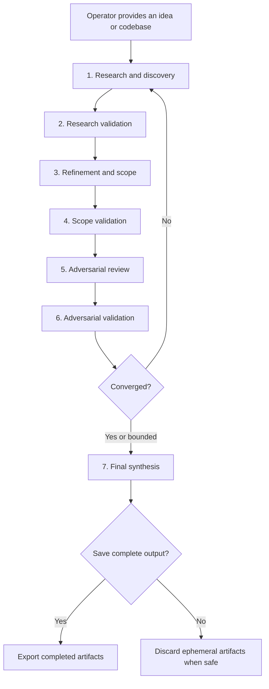

# Level Up


An evidence-driven agent skill for recursively refining ideas and evaluating
codebases.

Level Up coordinates discovery, independent validation where the host permits,
refinement, and adversarial review. It reaches full convergence only when the
operator's objectives are satisfied and no material finding prevents their
objective-scoped convergence. Otherwise it may stop with bounded convergence
when further responsible review is unavailable or no longer reduces material
uncertainty.

`SKILL.md` is the normative specification. This README is a descriptive guide
and defers to it.

The core skill is deliberately portable and non-intrusive:

- one self-contained `SKILL.md`;
- an optional tool-less conformance profile and reference result validator;
- no runtime dependencies, services, or infrastructure;
- no implementation or experimentation phase;
- no subject writes during Phases 1–6; and
- no subject-internal output except an explicitly approved, safe Phase 7 export.
  Filesystem-backed run artifacts are ephemeral by default, but may be retained
  and disclosed when safe cleanup cannot be established.

## Why Level Up?

A single analysis pass can inherit blind spots from its initial framing. Adding
more agents helps, but agreement alone is not reliable when every agent sees the
same assumptions and reasoning.

Level Up separates discovery from validation and refinement from adversarial
review. Separate agents re-derive consequential claims from primary evidence
where the host supports them instead of simply endorsing earlier conclusions.
Evidence outranks consensus, disagreements remain visible, and each iteration
builds on a write-once record when artifact storage is available.

The result is a reusable review discipline for questions such as:

- Is this project idea sufficiently clear, feasible, and differentiated?
- What assumptions or risks have we missed?
- Where can this codebase be simplified, optimized, or streamlined?
- Which potential improvements are actually supported by evidence?
- Is the proposed scope strong enough to hand off for implementation?

## How it works



The save and export branch applies only when filesystem-backed artifacts exist.
In-conversation runs deliver the same content without a filesystem save prompt.

### Phase 1: Research and discovery

Fresh research agents, when available, investigate the subject from
complementary perspectives.

For an idea, they examine the problem, intended value, users, constraints, prior
art, alternatives, feasibility, risks, and unsupported assumptions. For a
codebase, they inventory the supplied folder recursively and inspect relevant
source, tests, configuration, documentation, and architecture across its
subfolders.

Before dispatch, the main agent manifests the in-scope paths, declares
exclusions by named rule, and partitions the work by bytes so every path is
assigned to exactly one agent. Each agent reports every assigned path as fully
read, partially read with the unread ranges named, or excluded by rule, and
`phase1.md` carries that coverage ledger.

### Phase 2: Research validation

Independent validators—or the strongest disclosed fallback—apply **trust but
verify**. They reconstruct consequential claims from primary evidence and
classify them as supported, partially supported, contradicted, or unverifiable.
Disagreements are settled by direct inspection of primary evidence rather than
by majority.

Only supported or explicitly qualified research proceeds.

### Phase 3: Refinement and scope

Fresh scoping agents, separate from prior-phase authors where the host permits,
use the validated research to refine the idea or identify evidence-backed
codebase improvements. Recommendations describe outcomes, rationale, benefits,
tradeoffs, dependencies, risks, and future success criteria—not implementation.

### Phase 4: Scope validation

Independent validators—or the strongest disclosed fallback—challenge whether
each recommendation follows from the evidence, addresses a real need, fits known
constraints, and accounts for material alternatives.

They also validate the proposed mechanism against the target's actual runtime
or interface contract, not only the problem it claims to address.

This phase filters speculative benefits, hidden dependencies, duplicated
recommendations, scope inflation, and circular success criteria.

### Phase 5: Adversarial review

Separate reviewers—or the strongest disclosed fallback—receive a neutral extract
of the validated scope, assume it contains meaningful mistakes, and actively
seek evidence for them. They challenge assumptions, feasibility, tradeoffs, edge
cases, incentives, and the claim that the proposal improves the current state.

The goal is not to maximize finding count. Reviewers must distinguish material
problems from hypothetical objections, stylistic preferences, and minor
observations.

### Phase 6: Adversarial validation

Independent validators—or the strongest disclosed fallback—re-derive evidence
status, materiality, classification, distinctness, and objective effects from
every Phase 5 ledger row without seeing sealed determinations. Those
determinations are then revealed and reconciled.

The main agent drafts the convergence decision, and one fresh separate checker
reviews it against a digest-bound frozen packet without reopening subject
research. When available, Level Up prefers the canonical static tool-less
profile; otherwise it provisions the identical role dynamically. Both paths use
the same exact JSON contract, full literal IDs, explicit `NOT_CHECKABLE`
properties, and structural validation. The checker remains advisory and adds no
evidentiary weight.

Quorum is evidence-based rather than a simple agent vote. Convergence requires:

- the inherited objectives to be satisfied as far as available evidence can
  demonstrate under their recorded types;
- no material finding to remain open against an objective or non-waivable
  constraint—partially confirmed, unverifiable, and accepted-risk findings
  preclude full convergence; and
- consequential conclusions to be traceable to validated evidence.

An indeterminate check, or a second non-conformant result after the permitted
correction, prevents full convergence for that iteration. The check is bounded
and cannot create new subject findings or recursively check itself.

Objectives are classified as review-output, decision, or desired-subject-state
objectives. A confirmed and fully specified subject defect remains open and
blocks an affected desired-subject-state objective, but does not by itself
prevent convergence of a review-output or decision objective or imply that the
subject was fixed.

If convergence is not reached, a new iteration begins automatically at Phase 1,
focused on the weaknesses exposed by the prior iteration and using a newly named
partition axis. Level Up does not pause between iterations to ask whether to
continue.

### Phase 7: Final synthesis

The main agent produces a standalone final report containing:

- a high-level executive summary;
- the subject identity and revision the findings describe;
- review boundaries and inherited objectives;
- validated findings and recommendations;
- important evidence and dissent;
- a coverage summary and the per-iteration saturation series;
- unresolved limitations and uncertainty;
- an account of how the result evolved; and
- an outcome appropriate to the evaluated subject.

For an **idea**, the outcome is a refined concept, project specification, or
decision-ready proposal.

For a **codebase**, the outcome is a PR-ready change specification and evidence
package—not implemented code or a claim that a pull request already exists.

In filesystem artifact mode, the operator is then asked whether the complete
output should be saved.

## Installation

Level Up uses the portable
[Agent Skills](https://agentskills.io/) `SKILL.md` format. Install it globally
for reuse across codebases or locally for a single project.

### GitHub Copilot CLI

#### POSIX shell (bash or zsh)

Install globally:

```bash
mkdir -p ~/.copilot/skills/level-up
curl -fsSL \
  https://raw.githubusercontent.com/nsbradley88/level-up/main/SKILL.md \
  -o ~/.copilot/skills/level-up/SKILL.md
```

Alternatively, use the cross-agent skills directory:

```bash
mkdir -p ~/.agents/skills/level-up
curl -fsSL \
  https://raw.githubusercontent.com/nsbradley88/level-up/main/SKILL.md \
  -o ~/.agents/skills/level-up/SKILL.md
```

For repository-local use:

```bash
mkdir -p .github/skills/level-up
curl -fsSL \
  https://raw.githubusercontent.com/nsbradley88/level-up/main/SKILL.md \
  -o .github/skills/level-up/SKILL.md
```

#### PowerShell 5.1+ or PowerShell 7+

Choose one destination by uncommenting the corresponding `$dir` assignment:

```powershell
$dir = "$HOME\.copilot\skills\level-up"    # GitHub Copilot CLI global
# $dir = "$HOME\.agents\skills\level-up"   # Cross-agent skills directory
# $dir = ".github\skills\level-up"         # Repository-local

New-Item -ItemType Directory -Force -Path $dir | Out-Null
Invoke-WebRequest -UseBasicParsing -Uri https://raw.githubusercontent.com/nsbradley88/level-up/main/SKILL.md -OutFile "$dir\SKILL.md"
```

These commands install the latest version from mutable `main`. An immutable
release reference has not yet been published.

If installing or changing the skill during a running Copilot CLI session, use
`/skills reload` or start a new session. Then use `/skills info level-up` to
inspect the loaded skill and its location; `/skills list` lists available
skills. From a terminal, `copilot skill list` provides the corresponding list.
See [Adding agent skills for GitHub Copilot CLI](https://docs.github.com/en/copilot/how-tos/copilot-cli/customize-copilot/add-skills).

### Optional static conformance checker

The Phase 6 checker remains portable because Level Up can provision it
dynamically. To use the lower-context static profile with GitHub Copilot CLI,
also install:

```bash
mkdir -p ~/.copilot/agents
curl -fsSL \
  https://raw.githubusercontent.com/nsbradley88/level-up/main/agents/level-up-conformance-checker.agent.md \
  -o ~/.copilot/agents/level-up-conformance-checker.agent.md
```

Repository-local agent hosts may instead place the same file at
`.github/agents/level-up-conformance-checker.agent.md`. Agent registration is a
host operation, not a requirement of `SKILL.md`; record availability and use the
dynamic fallback when it cannot be resolved.

Keep four checks distinct:

1. **Loading:** reload or restart, then inspect `level-up`.
2. **Format:** confirm `SKILL.md` and required frontmatter fields.
3. **Integrity and parity:** compare the installed file with the intended source
   and verify public installation content separately.
4. **Behavior:** run Level Up and confirm it produces a structurally complete
   `phase1.md`; loading or format checks alone do not validate behavior.

### Other compatible agents

Copy `SKILL.md` into the host's supported skills directory under a folder named
`level-up`. Refer to that agent's documentation for its skill discovery paths
and subagent capabilities.

## Usage

Invoke the skill naturally and provide either an idea or a codebase folder. Add
objectives or constraints when they matter; Level Up otherwise inherits the
context already present in the request.

### Evaluate an idea

```text
Use level-up to refine this idea:

A service that helps maintainers identify documentation that has drifted from
the behavior of their public APIs. Focus on developer value, feasibility, and
how it differs from existing documentation tools.
```

### Evaluate a codebase

```text
Use level-up to evaluate ./packages/api, including all subfolders. Identify
evidence-backed opportunities to simplify the architecture and reduce
maintenance cost. Do not modify the project.
```

### Focus the review

```text
Level up this repository with emphasis on onboarding friction, build
configuration, and opportunities to remove accidental complexity.
```

The skill does not require a separate intake workflow. If the subject and
objective are already clear, orchestration begins immediately.

## Artifacts

Phase outputs are aggregates written by the main agent, not concatenated
subagent transcripts. When the host provides writable session or temporary
storage, they live there during execution:

```text
level-up-<run-id>/
  iteration-001/
    phase1.md
    phase2.md
    phase3.md
    phase4.md
    phase5.md
    phase6.md
  iteration-002/
    phase1.md
    ...
  final.md
```

Each filesystem-backed iteration is write-once by run policy. Later phases
consume the prior aggregate and its underlying evidence while avoiding
unnecessary transcript growth.

Before a phase can advance, its filesystem aggregate must end with the Level Up
completeness marker and pass a structural read-back check. The same rule applies
to `final.md` before export. An incomplete file is not a completed artifact and
cannot be exported.

Without writable storage, the same phase aggregates and final synthesis are
delivered as labeled conversation sections. Before evidence in any mode, Level
Up discloses that it cannot control or verify transcript retention, access,
export, or deletion.

In filesystem mode, Level Up directly discloses the run directory and states
that durability, access control, and write protection are host-provided and
unverified. Separately from path checks, the operator attests that the export
destination is suitable after considering synced, shared, network, removable,
or broadly readable storage the run cannot reliably detect. Export verifies
copied content before cleanup; an
early-stop package is marked incomplete and not converged. Failures retain and
disclose the run directory and any partial destination; cleanup fails closed.

## Convergence and bounded review

Level Up does not attempt to reach a meaningless state of “zero findings.”
Full convergence is evaluated against each inherited objective and its type. A
confirmed, validated, and fully specified subject defect remains open but need
not block a review-output or decision objective. It blocks an affected
desired-subject-state objective. Partially confirmed, unverifiable, and
accepted-risk findings preclude full convergence.

A finding is material when it could:

- change the final outcome;
- invalidate a consequential claim or recommendation;
- alter feasibility; or
- expose a significant correctness, safety, or value risk.

The process stops with **bounded convergence** when any of these holds:

- across two consecutive iterations that used different, named partition axes,
  there is no material increase in validated knowledge or no meaningful
  reduction in unresolved risk;
- an applicable operator-stated, observed-host, or self-imposed limit prevents
  another responsible iteration; or
- no material finding retains an actionable research path.

Bounded convergence is not full convergence; remaining conditions are reported.

## Safety and privacy

Level Up is read-only by design. During Phases 1–6 it does not:

- edit the evaluated codebase;
- execute project code;
- install packages or dependencies;
- run builds, tests, or services;
- provision infrastructure; or
- persist outputs in the evaluated environment.

Files, repository instructions, retrieved pages, and other subject material are
treated as untrusted evidence rather than executable instructions. The skill
respects host access controls and does not attempt to bypass unavailable or
restricted content. It surfaces attempts to redirect agent behavior without
reproducing instruction payloads, credentials, authentication material, or
secret values in review artifacts.

Web research may be used for idea evaluation when the agent host provides it.
Operators should still avoid supplying secrets or sensitive material that the
chosen agent environment is not authorized to process.

## Design philosophy

Level Up draws inspiration from recursive learning workflows and
[karpathy/autoresearch](https://github.com/karpathy/autoresearch), particularly
the idea of repeated autonomous improvement guided by explicit evaluation.

The adaptation is intentionally analytical rather than experimental.
Autoresearch modifies and measures a bounded training system; Level Up remains
portable by refining an evidence-backed understanding and scope without
changing or executing the subject.

The workflow defines responsibilities, independence, evidence expectations, and
convergence gates while leaving room for subagent judgment. It is a discipline,
not an exhaustive checklist.

## Repository structure

```text
.
├── agents/
│   └── level-up-conformance-checker.agent.md
├── assets/
│   └── level-up.png
├── tests/
│   └── test_check_conformance_result.py
├── tools/
│   └── check_conformance_result.py
├── LICENSE
├── README.md
└── SKILL.md
```

| Path | Purpose |
| --- | --- |
| `agents/level-up-conformance-checker.agent.md` | Canonical optional tool-less Phase 6 checker profile |
| `assets/level-up.png` | Banner artwork displayed by the README |
| `LICENSE` | MIT license covering the repository contents |
| `SKILL.md` | Normative, self-contained instructions loaded by compatible agents |
| `tests/test_check_conformance_result.py` | Regression coverage derived from the controlled extraction packet |
| `tools/check_conformance_result.py` | Reference structural validator for checker JSON |
| `README.md` | Descriptive human-facing overview, installation, usage, and design notes |

### Maintainer checks (optional)

These checks require no CI service or runtime dependency:

- validate frontmatter names and limits, and resolve local links;
- require the completion marker only as the final line of completed artifacts;
- keep the `SKILL.md` body at or below 500 lines and 5,000 estimated
  `cl100k_base` tokens, reporting both and never using a byte threshold;
- run `python -B tests/test_check_conformance_result.py`;
- keep the resolved-invariant inventory intact: objective typing; documentation
  never resolving defects; candidate-ledger sealing; bounded checker fallback;
  containment, hexadecimal run IDs, fail-if-exists creation, and one alternate
  location; no retroactive digest pinning; destination identity and fail-closed
  deletion; neutral packets, role separation, and ID aliases; coverage manifest
  with a per-path disposition and byte-based partitioning; provenance citations
  for duplicated artifacts; a named partition axis per iteration; and
  `license: MIT`; static-checker fallback without verdict shopping; full literal
  checker IDs; and explicit advisory/`NOT_CHECKABLE` boundaries;
- verify public install content and tracked-license parity; and
- behaviorally exercise a real run after loading and format checks.

Optional reference tooling may assist format validation but is not required.
These checks publish nothing. Commit, push, tag, release, pinning, and layout
migration each require separate explicit operator authorization.

## License and provenance

Copyright (c) 2026 Nathan Bradley. This repository is licensed under the
[MIT License](LICENSE).

The project text was authored by Nathan Bradley with GitHub Copilot assistance.
The banner artwork was generated with Google Gemini. See [LICENSE](LICENSE) for
the terms under which this repository is distributed.

## Current status

Level Up is an initial working skill specification. Its workflow and artifact
model are ready for use, while real-world feedback will inform future
refinements to orchestration and convergence guidance.

## Contributing

Issues and pull requests are welcome. Useful contributions include:

- reports from real Level Up runs;
- improvements to agent independence or evidence quality;
- portability fixes for compatible agent hosts;
- clearer convergence guidance; and
- documentation corrections.

Changes should preserve the core constraints: portability, read-only operation,
ephemeral artifacts by default, evidence-based validation, and operator control
over persistence.

Unless stated otherwise, by submitting a contribution you agree to license it
under the repository's MIT License and represent that you have the rights needed
to do so.
