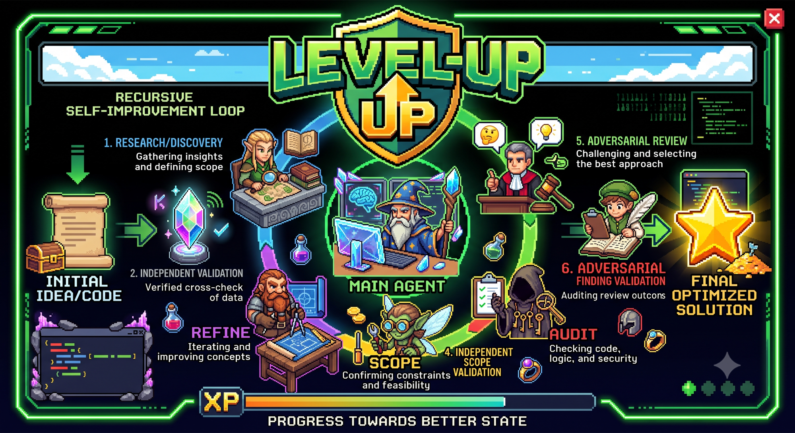
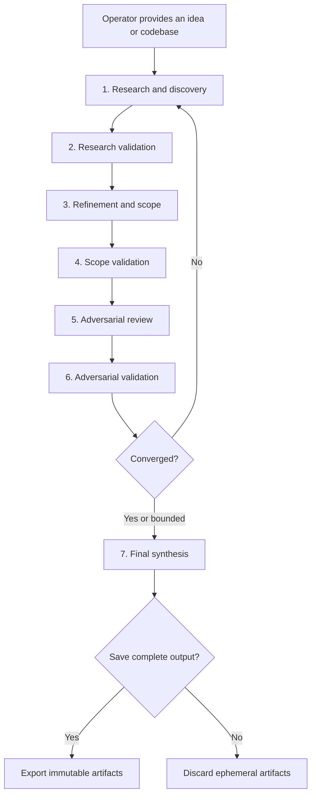

# Level Up



An evidence-driven agent skill for recursively refining ideas and evaluating
codebases.

Level Up coordinates multiple subagents through independent discovery,
validation, refinement, and adversarial review. It continues until the
operator's objectives are satisfied, no unresolved material findings remain, or
further review stops producing meaningful progress.

The skill is deliberately portable and non-intrusive:

- one self-contained `SKILL.md`;
- no runtime dependencies, services, or infrastructure;
- no implementation or experimentation phase;
- no modifications to the idea or codebase being evaluated; and
- no persistent artifacts unless the operator chooses to save them.

## Why Level Up?

A single analysis pass can inherit blind spots from its initial framing. Adding
more agents helps, but agreement alone is not reliable when every agent sees the
same assumptions and reasoning.

Level Up separates discovery from validation and refinement from adversarial
review. Fresh agents independently audit consequential claims instead of simply
endorsing earlier conclusions. Evidence outranks consensus, disagreements remain
visible, and each iteration builds on an immutable record.

The result is a reusable review discipline for questions such as:

- Is this project idea sufficiently clear, feasible, and differentiated?
- What assumptions or risks have we missed?
- Where can this codebase be simplified, optimized, or streamlined?
- Which potential improvements are actually supported by evidence?
- Is the proposed scope strong enough to hand off for implementation?

## How it works



### Phase 1: Research and discovery

Independent research agents investigate the subject from complementary
perspectives.

For an idea, they examine the problem, intended value, users, constraints, prior
art, alternatives, feasibility, risks, and unsupported assumptions. For a
codebase, they inventory the supplied folder recursively and inspect relevant
source, tests, configuration, documentation, and architecture across its
subfolders.

### Phase 2: Research validation

Fresh agents apply **trust but verify**. They reconstruct consequential claims
from primary evidence and classify them as supported, partially supported,
contradicted, or unverifiable.

Only supported or explicitly qualified research proceeds.

### Phase 3: Refinement and scope

Scoping agents use the validated research to refine the idea or identify
evidence-backed codebase improvements. Recommendations describe outcomes,
rationale, benefits, tradeoffs, dependencies, risks, and future success
criteria—not implementation.

### Phase 4: Scope validation

Independent validators challenge whether each recommendation follows from the
evidence, addresses a real need, fits known constraints, and accounts for
material alternatives.

This phase filters speculative benefits, hidden dependencies, duplicated
recommendations, scope inflation, and circular success criteria.

### Phase 5: Adversarial review

Fresh reviewers assume the validated scope contains meaningful mistakes and
actively seek evidence for them. They challenge assumptions, feasibility,
tradeoffs, edge cases, incentives, and the claim that the proposal improves the
current state.

The goal is not to maximize finding count. Reviewers must distinguish material
problems from hypothetical objections, stylistic preferences, and minor
observations.

### Phase 6: Adversarial validation

Fresh validators independently adjudicate every material adversarial finding.
The main agent then determines whether the review has converged.

Quorum is evidence-based rather than a simple agent vote. Convergence requires:

- the inherited objectives to be satisfied as far as available evidence can
  demonstrate;
- no confirmed, unresolved material findings; and
- consequential conclusions to be traceable to validated evidence.

If convergence is not reached, a new immutable iteration begins at Phase 1,
focused on the weaknesses exposed by the prior iteration.

### Phase 7: Final synthesis

The main agent produces a standalone final report containing:

- a high-level executive summary;
- review boundaries and inherited objectives;
- validated findings and recommendations;
- important evidence and dissent;
- unresolved limitations and uncertainty;
- an account of how the result evolved; and
- an outcome appropriate to the evaluated subject.

For an **idea**, the outcome is a refined concept, project specification, or
decision-ready proposal.

For a **codebase**, the outcome is a PR-ready change specification and evidence
package—not implemented code or a claim that a pull request already exists.

The operator is then asked whether the complete output should be saved.

## Installation

Level Up uses the portable
[Agent Skills](https://agentskills.io/) `SKILL.md` format. Install it globally
for reuse across codebases or locally for a single project.

### GitHub Copilot CLI

Install globally:

```bash
mkdir -p ~/.copilot/skills/level-up
curl -fsSL \
  https://raw.githubusercontent.com/nsbradley88/level-up/main/SKILL.md \
  -o ~/.copilot/skills/level-up/SKILL.md
```

Alternatively, use the cross-agent skills directory:

```bash
mkdir -p ~/.agents/skills/level-up
curl -fsSL \
  https://raw.githubusercontent.com/nsbradley88/level-up/main/SKILL.md \
  -o ~/.agents/skills/level-up/SKILL.md
```

For repository-local use:

```bash
mkdir -p .github/skills/level-up
curl -fsSL \
  https://raw.githubusercontent.com/nsbradley88/level-up/main/SKILL.md \
  -o .github/skills/level-up/SKILL.md
```

Use `/skills` in GitHub Copilot CLI to inspect and manage available skills.

### Other compatible agents

Copy `SKILL.md` into the host's supported skills directory under a folder named
`level-up`. Refer to that agent's documentation for its skill discovery paths
and subagent capabilities.

## Usage

Invoke the skill naturally and provide either an idea or a codebase folder. Add
objectives or constraints when they matter; Level Up otherwise inherits the
context already present in the request.

### Evaluate an idea

```text
Use level-up to refine this idea:

A service that helps maintainers identify documentation that has drifted from
the behavior of their public APIs. Focus on developer value, feasibility, and
how it differs from existing documentation tools.
```

### Evaluate a codebase

```text
Use level-up to evaluate ./packages/api, including all subfolders. Identify
evidence-backed opportunities to simplify the architecture and reduce
maintenance cost. Do not modify the project.
```

### Focus the review

```text
Level up this repository with emphasis on onboarding friction, build
configuration, and opportunities to remove accidental complexity.
```

The skill does not require a separate intake workflow. If the subject and
objective are already clear, orchestration begins immediately.

## Artifacts

Phase outputs are aggregates written by the main agent, not concatenated
subagent transcripts. They live in host-provided session or temporary storage
during execution:

```text
level-up-<run-id>/
  iteration-001/
    phase1.md
    phase2.md
    phase3.md
    phase4.md
    phase5.md
    phase6.md
  iteration-002/
    phase1.md
    ...
  final.md
```

Each iteration is immutable. Later phases consume the prior aggregate and its
underlying evidence while avoiding unnecessary transcript growth.

After Phase 7, the operator can export the entire directory. If the operator
declines, nothing is written to the evaluated environment and the ephemeral
artifacts are discarded when safe.

## Convergence and bounded review

Level Up does not attempt to reach a meaningless state of “zero findings.”
Review ends when objectives are met and no confirmed material findings remain.

A finding is material when it could:

- change the final outcome;
- invalidate a consequential claim or recommendation;
- alter feasibility; or
- expose a significant correctness, safety, or value risk.

The process also avoids infinite refinement. If two consecutive iterations
produce no material increase in validated knowledge or meaningful reduction in
unresolved risk, the skill stops with **bounded convergence** and reports the
remaining uncertainty.

## Safety and privacy

Level Up is read-only by design. During evaluation it does not:

- edit the evaluated codebase;
- execute project code;
- install packages or dependencies;
- run builds, tests, or services;
- provision infrastructure; or
- persist outputs without operator approval.

Files, repository instructions, retrieved pages, and other subject material are
treated as untrusted evidence rather than executable instructions. The skill
respects host access controls and does not attempt to bypass unavailable or
restricted content.

Web research may be used for idea evaluation when the agent host provides it.
Operators should still avoid supplying secrets or sensitive material that the
chosen agent environment is not authorized to process.

## Design philosophy

Level Up draws inspiration from recursive learning workflows and
[karpathy/autoresearch](https://github.com/karpathy/autoresearch), particularly
the idea of repeated autonomous improvement guided by explicit evaluation.

The adaptation is intentionally analytical rather than experimental.
Autoresearch modifies and measures a bounded training system; Level Up remains
portable by refining an evidence-backed understanding and scope without
changing or executing the subject.

The workflow defines responsibilities, independence, evidence expectations, and
convergence gates while leaving room for subagent judgment. It is a discipline,
not an exhaustive checklist.

## Repository structure

```text
.
├── README.md
└── SKILL.md
```

| File | Purpose |
| --- | --- |
| `SKILL.md` | Self-contained instructions loaded by compatible agents |
| `README.md` | Human-facing overview, installation, usage, and design notes |

## Current status

Level Up is an initial working skill specification. Its workflow and artifact
model are ready for use, while real-world feedback will inform future
refinements to orchestration and convergence guidance.

## Contributing

Issues and pull requests are welcome. Useful contributions include:

- reports from real Level Up runs;
- improvements to agent independence or evidence quality;
- portability fixes for compatible agent hosts;
- clearer convergence guidance; and
- documentation corrections.

Changes should preserve the core constraints: portability, read-only operation,
ephemeral artifacts by default, evidence-based validation, and operator control
over persistence.
